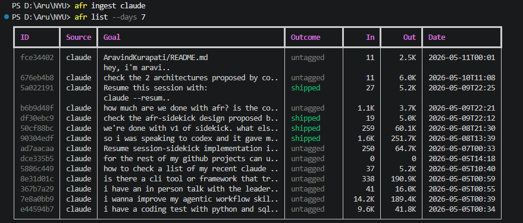
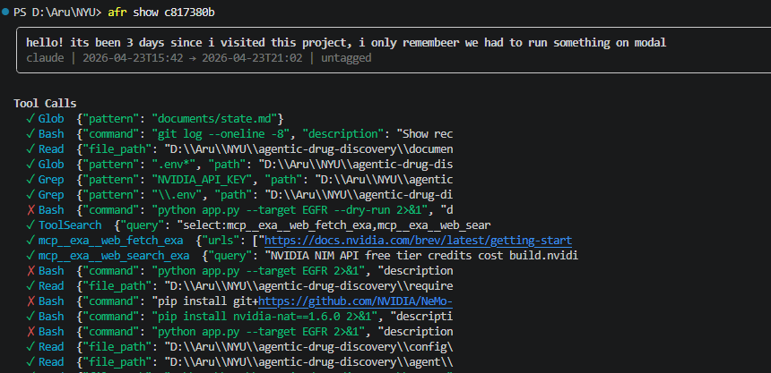
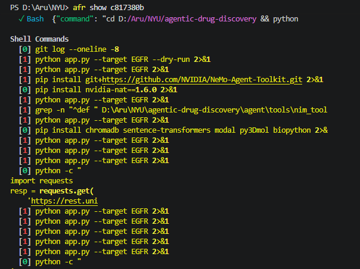
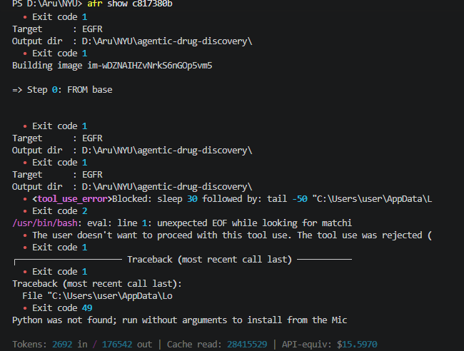
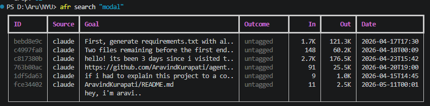
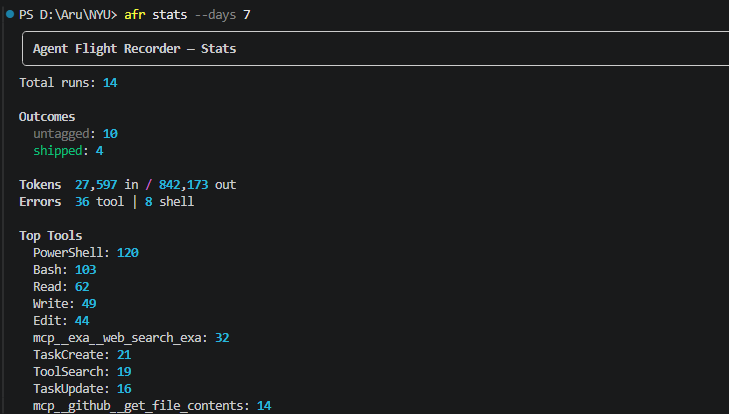

# agent-flight-recorder

> **Every agent session you run disappears the moment it ends. This one doesn't.**

A CLI that records every Claude Code and Codex session - prompts, tool calls, shell commands, file changes, errors and token costs into a searchable SQLite database. Find what you worked on, see what failed and extract reusable workflow patterns.

---

## The problem this solves

AI coding sessions are opaque. When a session ends, all you have is changed files and a vague memory of what the agent tried. There's no way to answer:

- What tools did the agent call, and in what order?
- Which shell commands failed, and what was the error?
- How much did that session actually cost in tokens?
- Why does this same class of problem keep taking 3 sessions to fix?

`afr` records all of that and keeps it queryable - locally, permanently, without sending anything to a server.

---

## Install

```bash
git clone https://github.com/AravindKurapati/agent-flight-recorder
cd agent-flight-recorder
pip install -e .
```

**Requirements:** Python 3.11+ -  no API keys, no accounts, everything stays on your machine.

---

## Usage

### Ingest your sessions

```bash
afr ingest claude     # reads ~/.claude/projects/**/*.jsonl
afr ingest codex      # reads ~/.codex/sessions/**/*.jsonl
```

Or wire a Claude Code hook to ingest automatically after every session (add to `~/.claude/settings.json`):

```json
{
  "hooks": {
    "Stop": [{ "matcher": "", "hooks": [{ "type": "command", "command": "afr ingest claude" }] }]
  }
}
```

### Browse recent runs

```bash
afr list --days 7
```



### Inspect a session

```bash
afr show 50c3f2a1
```





### Search across all sessions

```bash
afr search "authentication"
afr search "modal" --days 30
```


### See patterns across sessions

```bash
afr stats --days 30
```



### See your 5-hour usage windows

```bash
afr config set weekly-reset "Wed 00:00"      # when your weekly cap resets
afr config set timezone "America/New_York"   # your display timezone (IANA)
afr windows
```

`afr windows` reconstructs the Anthropic 5-hour usage windows you actually
opened (from recorded run timestamps) and shows how many fresh windows fit
before your weekly reset. This is the *time/window* view; for the token-budget
forecast, use claude-burnrate with `/usage`.

### Export a session as markdown

```bash
afr export 50c3f2a1              # prints to stdout
afr export 50c3f2a1 --out report.md   # writes to file
```

Valid outcomes: `shipped`, `blocked`, `abandoned`, `exploratory`

### Extract reusable workflow skills

After a few sessions solving the same class of problem, run:

```bash
afr extract-skills --min-runs 3
```

```
Candidate: deployment-modal-debug
  4 sessions | tools: Bash, Read | errors: 6
  Generate SKILL.md? [y/n]: y
  Written → generated_skills/deployment-modal-debug/SKILL.md
```

It clusters sessions by keyword similarity, finds ones that ended in `shipped`, and drafts a `SKILL.md` from the successful tool sequence. You approve before anything is written.

---

## All commands

| Command | What it does |
|---------|-------------|
| `afr ingest claude` | Parse `~/.claude/` sessions into the database |
| `afr ingest codex` | Parse `~/.codex/` sessions into the database |
| `afr list [--days N]` | Table of recent runs with goals, outcomes, and token in/out |
| `afr show <id>` | Full detail: tool calls, shell commands, errors, cost |
| `afr search <query>` | Full-text search across run goals and summaries |
| `afr stats [--days N]` | Outcome distribution, top tools, error counts |
| `afr tag <id> <outcome>` | Label a run: shipped / blocked / abandoned / exploratory |
| `afr export <id> [--out file]` | Export session as a markdown report |
| `afr extract-skills` | Cluster sessions, propose SKILL.md candidates |

`<id>` accepts the first 8 characters from `afr list` output.

---

## What gets recorded

For each session:

- **Goal** - first user message
- **Tool calls** - every tool fired, input summary, success or error
- **Shell commands** - command, exit code, stdout/stderr excerpt
- **File events** - every read, write, patch, or delete
- **Errors** - failed tool calls and non-zero shell exits
- **Token counts** - input, output, cache read, cache write
- **Outcome** - you tag this: `shipped`, `blocked`, `abandoned`, `exploratory`

Secrets are redacted before anything is written to the database (API keys, bearer tokens, private keys, `.env` contents).

---

## How data is stored

Everything lives at `~/.afr/afr.db` - a single SQLite file on your machine. No data leaves your machine. 

You can query it directly with any SQLite client:

```bash
sqlite3 ~/.afr/afr.db "SELECT user_goal, outcome, tokens_in FROM runs ORDER BY started_at DESC LIMIT 10"
```

---

## Supported agents

| Agent | Source | Adapter |
|-------|--------|---------|
| Claude Code | `~/.claude/projects/**/*.jsonl` | Full - tool calls, tokens, errors |
| Codex (OpenAI) | `~/.codex/sessions/**/*.jsonl` | Full - tool name mapping, tokens, errors |

---

## License

MIT
